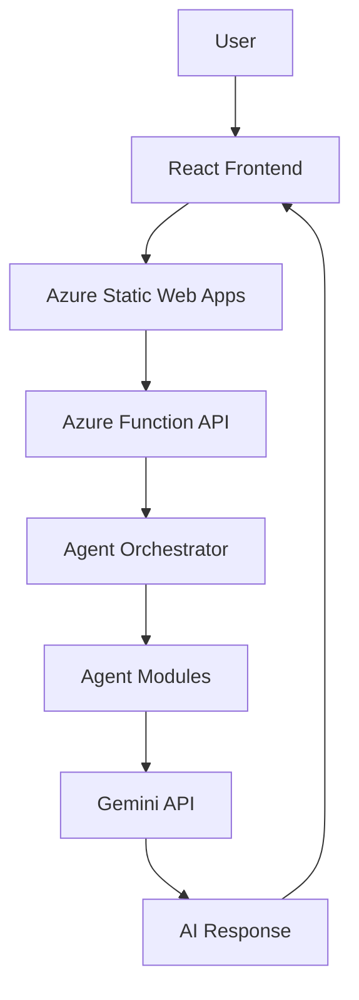

# Plume

Plume is an AI-powered conversational web application designed to provide supportive interactions through a chat interface. The system integrates a modern React frontend with a serverless backend and an AI-driven agent architecture.

The backend is implemented using Azure Functions and includes multiple agent modules responsible for classification, emotional profiling, conversation memory, and response generation using the Gemini API.

The application is deployed using Azure Static Web Apps with automated CI/CD through GitHub Actions.

---

## Tech Stack

### Frontend
- React 
- Vite 
- CSS 

### Authentication
- Microsoft Authentication Library (MSAL)
- Microsoft Identity Platform

### Backend
- Azure Functions (Serverless) 
- Python 

### AI Integration
- Google Gemini API 
- Agent-based conversation orchestration

### Cloud Platform
- Azure Static Web Apps 

### Storage
- Browser Local Storage (conversation history)

---

## Features

### Microsoft Authentication
Users sign in using their Microsoft account via MSAL authentication.

### Conversational Chat Interface
Users interact with a chat interface that sends messages to the backend API.

### AI Response Generation
User inputs are processed by the backend and sent to the Gemini API to generate contextual responses.

### Agent-based Processing
The backend includes modular AI components that perform different roles in the conversation pipeline.

These include:
- message classification
- emotional profiling
- conversation memory tracking
- response strategy selection
- orchestration of the response generation pipeline

### Conversation History
Chat conversations are stored locally in the browser using `localStorage`.

### Serverless Backend
The backend API runs as an Azure Function and is exposed through the `/api` route.

---

## Architecture

```
User Interface (React + Vite)
            │
            │  MSAL Authentication
            ▼
Azure Static Web Apps
            │
            │  /api/chat
            ▼
Azure Function (Python)
            │
            ▼
Agent Orchestrator
   │        │         │
   ▼        ▼         ▼
Classifier  Emotion   Memory
            Profile
                │
                ▼
          Strategy Engine
                │
                ▼
            Gemini API
                │
                ▼
       AI Response returned
```

---

## Project Structure

```
Plume
│
├── frontend
│   ├── src
│   │   ├── components
│   │   │   ├── ChatMessage.jsx
│   │   │   └── LoadingIndicator.jsx
│   │   │
│   │   ├── App.jsx
│   │   ├── authConfig.js
│   │   └── main.jsx
│   │
│   ├── package.json
│   └── vite.config.js
│
├── serverless-backend
│   ├── agent
│   │   ├── classifier.py
│   │   ├── crisis_engine.py
│   │   ├── emotional_profile.py
│   │   ├── memory.py
│   │   ├── mood_tracker.py
│   │   ├── orchestrator.py
│   │   ├── prompts.py
│   │   └── strategy_engine.py
│   │
│   ├── function_app.py
│   └── host.json
|   |__requirements.txt
│
└── README.md
```

---

## Running the Frontend Locally

Clone the repository

```
git clone https://github.com/s17anushka/Plume.git
```

Navigate to the frontend

```
cd frontend
```

Install dependencies

```
npm install
```

Run development server

```
npm run dev
```

The app will run at

```
http://localhost:5173
```

---

## Deployment

The project is deployed using **Azure Static Web Apps**.

Deployment pipeline:

1. Code pushed to GitHub
2. GitHub Actions builds the React application
3. Azure Static Web Apps deploys the frontend
4. Azure Functions runs the serverless backend
5. Backend communicates with the Gemini API to generate responses

---

## Current Status

The project includes:

- A Basic React chat interface
- Microsoft authentication
- Serverless backend with Azure Functions
- Modular AI agent architecture
- Gemini API integration
- Local conversation storage
- Automated cloud deployment pipeline

---
## AI Processing Pipeline

The backend includes a set of modular agent components that support the conversational workflow.  
These modules help analyze user messages, maintain conversation context, and guide response generation.

The agent modules include:

- **Classifier** – analyzes the type or intent of the user message.
- **Emotional Profile** – evaluates the emotional tone of the conversation.
- **Crisis Engine** – detects potential crisis or high-risk signals.
- **Memory Module** – maintains conversation context across messages.
- **Mood Tracker** – tracks emotional trends over time within a conversation.
- **Strategy Engine** – determines the appropriate response strategy.

These modules are coordinated by an **orchestrator**, which prepares the prompt and sends the request to the **Gemini API** for response generation.

The generated response is then returned to the frontend chat interface.

## System Architecture


## Limitations

While Plume demonstrates a modular AI-assisted conversational system, the current implementation has several limitations:

- **Prototype-level system**  
  The project is designed as a proof-of-concept and experimental architecture rather than a production-ready mental health platform.

- **AI responses may be imperfect**  
  Responses generated through the Gemini API may occasionally be inaccurate, overly generic, or contextually incomplete.

- **Limited long-term memory**  
  Conversation memory is currently maintained within the session and does not persist across long-term user histories.

- **Crisis detection is heuristic-based**  
  Crisis detection logic is experimental and should not be relied upon for real-world clinical decision-making.

- **No professional medical validation**  
  The system is not intended to replace professional mental health support or therapy.

- **Frontend state persistence**  
  Conversation history is stored in browser local storage rather than a persistent database.

- **Scalability not evaluated**  
  The system has not yet been tested for large-scale usage or high concurrency plus my deployed live link was under free tier .

Future work may address these limitations by improving model prompting, adding persistent storage, and expanding safety mechanisms.

## Author
**Anushka Singh**  

 CSE Student


